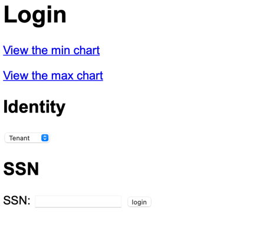
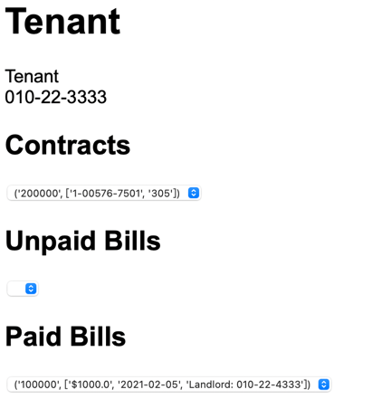
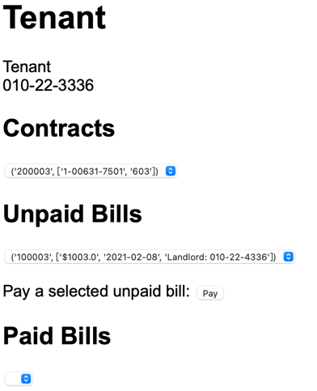
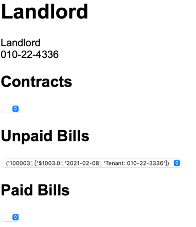
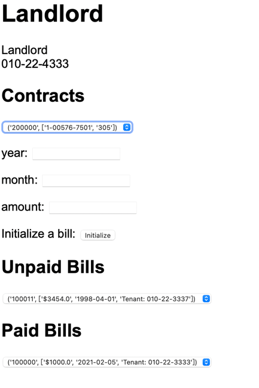

# Renting-system

## PostgreSQL Account
zw2771

## URL of the Web Application

## Description of Application
1. Parts Implemented:
  - Customers, both tenants and landlords, are able to see their houses.
  - It functions as a prototype of payment system: tenants can pay for the bill and landlords can initilaze new bills.
  - Visualiztions are added so customers will have a better view on the current prices of housing over New York.

2. Parts Unimplemented:
  - Nothing

3. New Features:
  - The agents are able to draft new contracts for tenants and landlords.

## login

when you type in the IP address of the Google Cloud 
virtual machine and the port number, 
the default page is the login page.  

In this page, we can select from the "Identity"
part which kind of user you are: Tenant, Landlord
and Agency. Then, you have to type in your SSN
so that the system will know who you are when
you log in.

If you type in the wrong Identity or SSN, the 
system will stay on the login page and do 
nothing. Only after you type in the right user
 information, the system will jump to different
page according to the identity you are.

## Tenant

In the tenant page, it shows the identity and 
SSN of the user at the top of the page.

The Contracts section lists all the contracts
the tenant is involved in. 

The Unpaid Bills section lists all the unpaid
bills the tenant has not paid yet.

The Paid Bills section lists all the payment
history the tenant made before.

In the picture above, because the tenant does not
have unpaid bills, he does not need to make payments.

However, like the picture shown as follows,
if the tenant has unpaid bills, the 
page will show a "Pay" button. Once you click
the pay button, it means the tenant pays for the 
bills selected. Then, the bill information will
disappear from the unpaid bills section and appear
in the Paid Bills section.

## Landlord

When you log in as a landlord, the page also 
shows your user information. The contracts section
also contain all the contracts the landlord relates
to. The unpaid bills section contains all the unpaid bills
that have not paid to the landlord.

The Paid Bills section contains all the bills that
have already paid to the landlord.

The landlords can initialize payments. However, 
they cannot initialize payments casually. Only
when there have one or more contracts can they
initialize payments. Thus, in the picture above,
when the landlord has no contract, he cannot 
initialize a payment. In the picture below, the 
landlord can initialize a payment by selecting
a certain contract, typing in the date information
and the amount of money.

